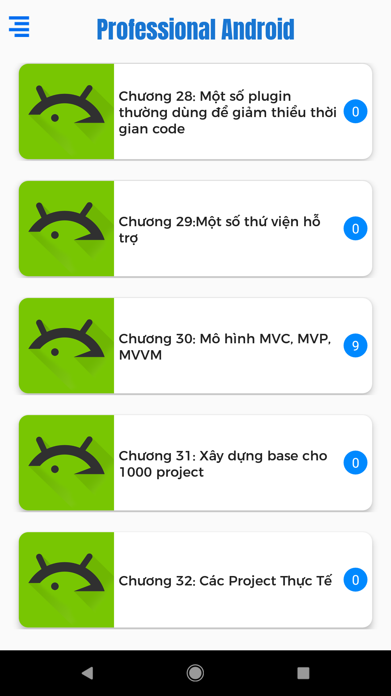
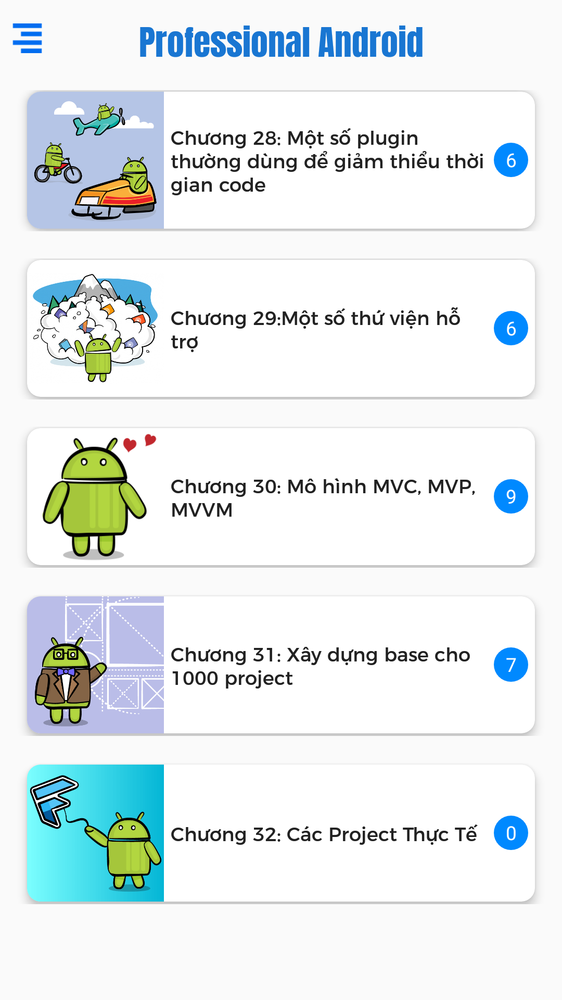
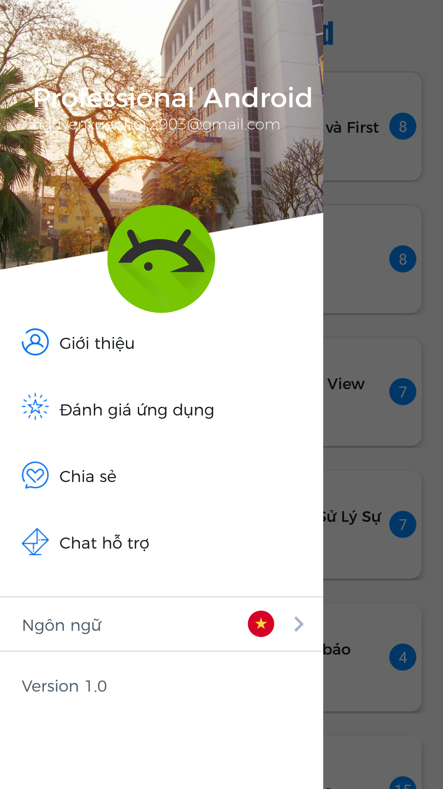
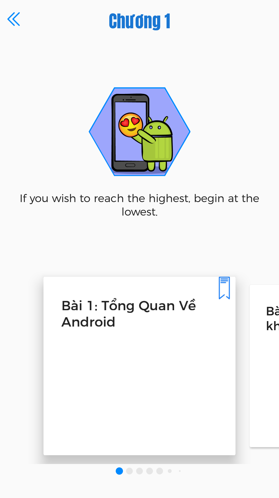
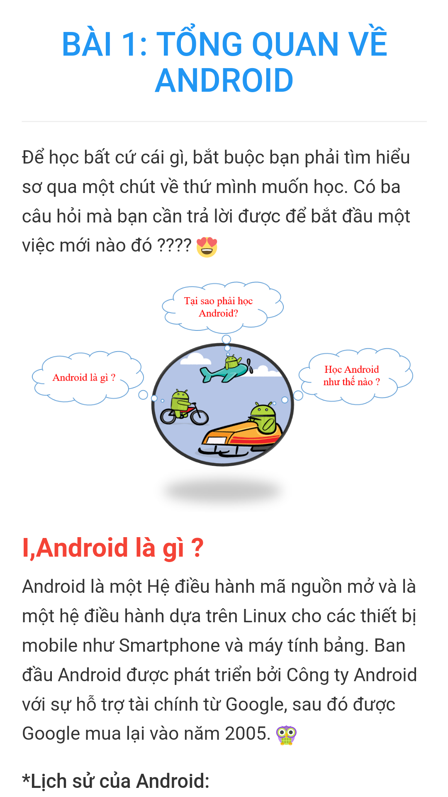
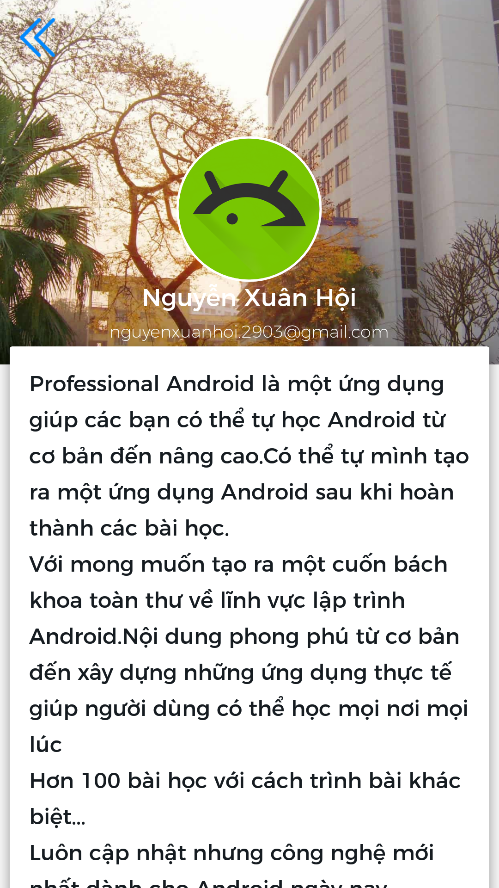

# Android_Professional
Professional Android là một ứng dụng giúp các bạn có thể tự học Android từ cơ
bản đến nâng cao.Có thể tự mình tạo ra một ứng dụng Android sau khi hoàn thành
các bài học.  
Với mong muốn tạo ra một cuốn bách khoa toàn thư về lĩnh vực lập trình
Android.Nội dung phong phú từ cơ bản đến xây dựng những ứng dụng thực tế giúp
người dùng có thể học mọi nơi mọi lúc   
  
Hơn 100 bài học với cách trình bài khác biệt.  
  
Luôn cập nhật nhưng công nghệ mới nhất dành cho Android ngày nay.  
  
Tại sao Bạn nên dùng Professional Android  
- Có được kiến thức toàn diện về ngôn ngữ lập trình Java cũng như Android hiện
nay.  
- Nắm rõ những kiến thức về lập trình Android từ cơ bản đến nâng cao đến các ứng
dụng thực tế.  
- Có khả năng tạo được những ứng dụng Android, ứng dụng game Android.  
- Có thể xây dựng được một base dành cho mọi ứng dụng.
# Google Play ---Professional Android---
[images/en_badge_web_generic.png](https://play.google.com/store/apps/details?id=com.mteam.android_professional)

# ScreenShots

   

  

